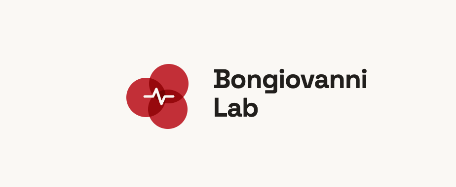

  

 

## About Us

We are a dynamic research group at **Universitätsklinikum Augsburg** (University Hospital Augsburg), dedicated to advancing the understanding of cardiovascular disease and translating scientific discoveries into tangible benefits for patients. We bridge experimental biology and clinical practice, combining international collaborations, modern research methods, and cross-disciplinary innovation to improve cardiovascular health globally.

---

## Research Focus

### Thrombosis & Antithrombotic Therapies
Investigating the molecular mechanisms of thrombosis and developing novel antithrombotic strategies to identify therapeutic targets for the prevention and treatment of cardiovascular events.

### Thromboimmune Phenotyping
Exploring the complex interplay between platelets and the immune system and how thrombotic and immune processes interact in cardiovascular disease, to uncover new biomarkers and enable personalised treatment strategies.

### Interventional Cardiology
Studying innovative techniques and devices to improve outcomes in acute coronary syndromes and other cardiovascular conditions through minimally invasive procedures.

### Digital Medicine
From mobile health applications to remote patient monitoring, we investigate how digital technologies can transform patient care and disease management in cardiology.

### AI Unit in Cardiology
In collaboration with the Chair of Diagnostic Sensing (Prof. Zaunseder), our AI unit applies machine learning to refine diagnostic workflows, enable personalised treatment, and advance precision medicine in cardiovascular care through an open innovation platform.

---

## Team

**Principal Investigator**

Prof. Dr. med. Dario Bongiovanni, PhD

**Members**

Dr. Olena Babyak
Dr. Kilian Kirmes
Dr. Pierre Aublin
Dr. med. Stephanie Kühne
Leonora Raka
Nazanin Anbarestani
Farnoosh Solati

---

*University Hospital Augsburg - Experimental Cardiology & Translational Research*
